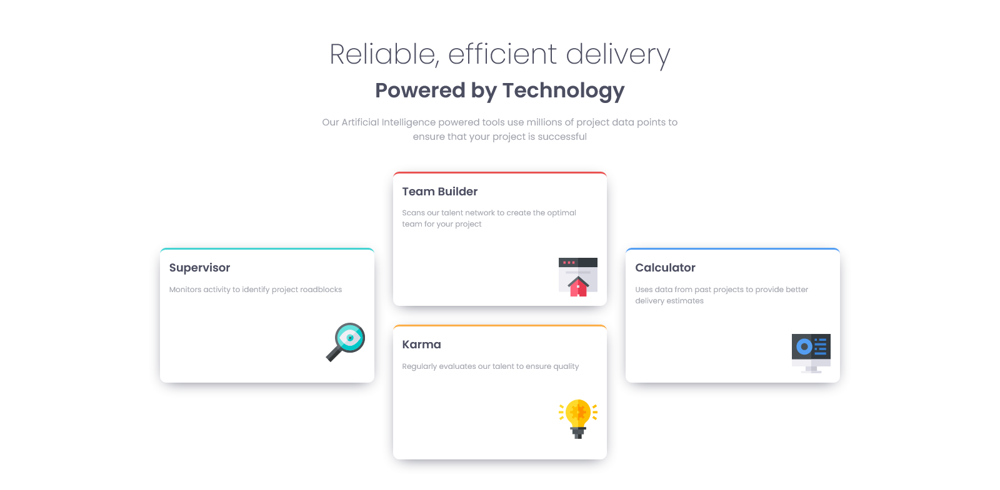
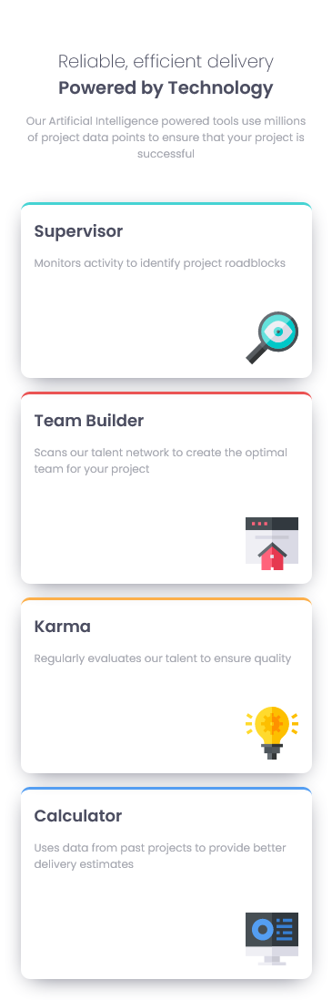

# Frontend Mentor - Four card feature section solution

This is a solution to the [Four card feature section challenge on Frontend Mentor](https://www.frontendmentor.io/challenges/four-card-feature-section-weK1eFYK).

## Table of contents

-   [Overview](#overview)
    -   [The challenge](#the-challenge)
    -   [Screenshot](#screenshot)
    -   [Links](#links)
-   [My process](#my-process)
    -   [Built with](#built-with)
    -   [What I learned](#what-i-learned)
    -   [Useful resources](#useful-resources)
-   [Author](#author)

## Overview

### The challenge

Users should be able to:

-   View the optimal layout for the site depending on their device's screen size

### Screenshot

1.Desktop



2.Mobile



### Links

-   Solution URL: https://your-solution-url.com
-   Live Site URL: https://asadullahbadhan.github.io/four-card-feature-section/

## My process

### Built with

-   Semantic HTML5 markup
-   CSS custom properties
-   Flexbox
-   CSS Grid
-   Mobile-first workflow

### What I learned

I learned from this project how use grid system to build complex layouts.

Here is the code example:

```scss
.feature-card {
	display: grid;
	grid-template-columns: repeat(3, 1fr);
	grid-template-rows: repeat(4, 1fr);

	&:nth-child(1) {
		border-top: 3px solid $cyan;
		margin-top: 0;
		grid-row: 2 / 4;
	}
	&:nth-child(2) {
		border-top: 3px solid $red;
		grid-column: 2 / 3;
		grid-row: 1 / 3;
	}
	&:nth-child(3) {
		border-top: 3px solid $orange;
		grid-column: 2 / 3;
		grid-row: 3 / 5;
	}
	&:nth-child(4) {
		border-top: 3px solid $blue;
		grid-column: 3 / 4;
		grid-row: 2 / 4;
	}
}
```

### Useful resources

-   [Kevin Powell - Learn CSS Grid the easy way](https://www.youtube.com/watch?v=rg7Fvvl3taU) - This youtube video helped me to understand grid system.

## Author

-   Website - Asadullah Badhan
-   Frontend Mentor - [@AsadullahBadhan](https://www.frontendmentor.io/profile/AsadullahBadhan)
